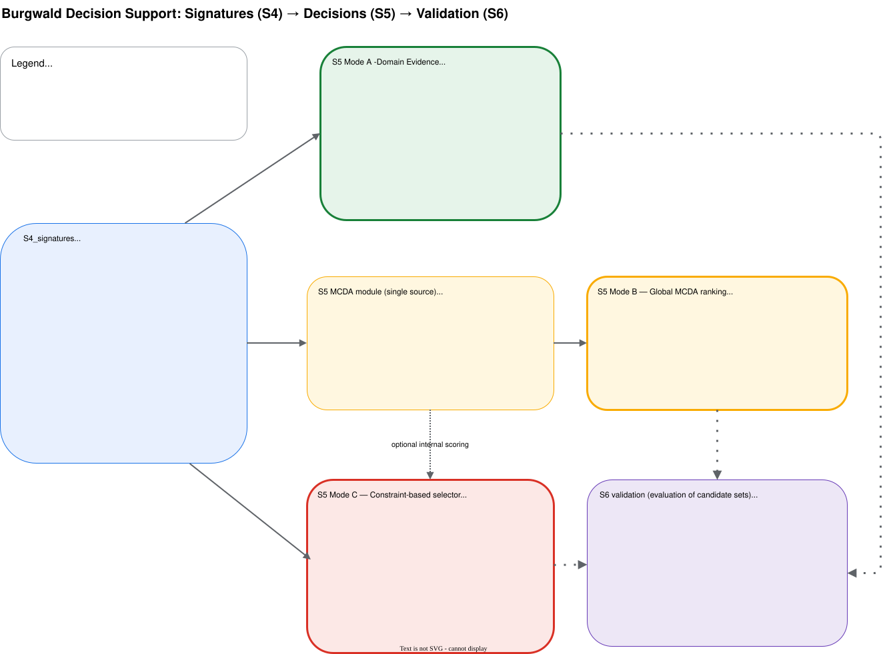

# Part I — Reader  
## From landscape signatures to explicit decision logic

### Evidence accumulation and the decision gap

After segmentation and attribution are completed, each segment in the Burgwald workflow represents a spatial object with a dense, multi-domain signature. Structural pattern metrics describe internal spatial organisation, physiographic variables encode terrain and exposure, hydrological attributes describe flow organisation and connectivity, biostructural metrics characterise vegetation structure, and land-cover fractions describe composition and dominance.

At this stage the analytical problem changes qualitatively. The task is no longer to extract descriptors, but to transform heterogeneous evidences into operational decisions. This transition is not merely technical. It introduces assumptions about comparability, trade-offs, admissibility, optimality and robustness. In decision theory this is the classical shift from measurement to preference modelling and choice under constraints [@saaty1980; @keeneyraiffa1993].

In many spatial decision systems these assumptions are hidden inside composite indices or optimisation algorithms, making it difficult to understand which modelling choices actually drive the result. This opacity is problematic for scientific reproducibility and for applied decision support in environmental planning [@malczewski2006; @malczewski2015].

The Burgwald workflow therefore exposes decision logic explicitly instead of embedding it implicitly. Rather than enforcing a single optimisation paradigm, three complementary decision strategies are implemented. They operate on the same evidence base but represent different epistemic positions.

All strategies consume a single truth source:

```

S4_signatures / layer0_segments_attrstack_metrics.gpkg

```

This dataset contains the complete segment-level evidence state. Downstream processing does not modify this evidence; it only reinterprets and recombines it.

---

### Domain reasoning versus integration

A fundamental methodological tension arises from the heterogeneity of domains. Structural pattern metrics, hydrological connectivity, vegetation structure and land-cover composition do not share a common natural scale or process interpretation. Early fusion risks masking domain-specific behaviour and introducing circular validation effects.

Exploratory spatial analysis and process-based modelling therefore traditionally preserve domain separation during early analytical stages [@openshaw1984; @goodchild2011]. At the same time, applied planning and monitoring design necessarily require integration across domains because resources, feasibility and spatial constraints must be balanced.

<a href="../images/05-9-overall-decision-path.svg" target="_blank">
  
</a>

The three decision modes implemented in Burgwald represent different answers to this integration problem.

---

### Mode A — Domain evidence

Mode A keeps domains analytically isolated. Each S4 domain script (IT, physiography, hydrology, biostructure, coverage) performs clustering, stratification and representative candidate selection strictly within its own feature space.

Methodologically this corresponds to single-criterion or single-process reasoning. It supports interpretability, internal consistency checks and validation of signature behaviour. Similar approaches are common in landscape ecology, geomorphometry and hydrology when domain mechanisms must first be understood independently [@mcgarigal2012; @wilson2018].

Mode A deliberately avoids claims of global representativeness or optimisation. It answers the epistemic question of how the landscape appears when observed through one conceptual lens at a time.

---

### Mode B — Global MCDA ranking

Mode B represents the classical multi-criteria integration paradigm. Heterogeneous evidences are transformed onto a common scale, weighted and aggregated into a single scalar score using Multi-Criteria Decision Analysis (MCDA).

MCDA provides a transparent formal framework for preference modelling and trade-off analysis and is widely used in spatial planning, site selection and environmental assessment [@saaty1980; @malczewski2006; @malczewski2015].

The strength of this approach lies in its simplicity, reproducibility and sensitivity analysis capability. However, aggregation implicitly assumes that all objectives can be meaningfully collapsed into a single utility function. Spatial configuration, coverage guarantees and feasibility constraints are not inherently represented.

Mode B therefore provides a global reference perspective rather than a complete operational decision solution.

---

### Mode C — Constraint-based selector

Mode C reflects the logic of real-world design problems. In operational settings, admissibility constraints, representational requirements and spatial feasibility often dominate over pure optimisation objectives.

The selector formalises this logic explicitly by separating:

- admissibility (filtering),
- representational guarantees (coverage targets),
- prioritisation (ranking),
- spatial feasibility (spacing).

Ranking itself can remain lexicographic for maximal transparency or can internally use MCDA as a scoring module when controlled trade-offs are desired. Importantly, MCDA in this context does not define the decision; it only orders candidates inside an explicitly constrained design space.

This logic corresponds to constrained optimisation and rule-based decision support systems rather than classical utility maximisation [@papadimitriou1998; @raiffa1968].

Mode C supports scenario design, policy reasoning and reproducible operational decision making.

---

### Complementarity instead of hierarchy

The three modes are not pipeline stages and not competitors. They represent complementary epistemic strategies:

- Mode A prioritises interpretability and domain clarity.
- Mode B prioritises formal integration and comparability.
- Mode C prioritises operational feasibility and explicit governance of trade-offs.

Keeping these strategies separated avoids hidden assumptions, circular validation and black-box optimisation. Decision quality emerges from transparent comparison of their outcomes rather than from a single optimal solution.

# Part II — Hands-on  

## Scenario-driven decision design

The following scenarios illustrate how the three decision strategies translate into concrete monitoring design problems. Each scenario starts from a real planning question, explains the underlying trade-offs and then shows how this logic is encoded operationally. The emphasis is not on producing a single “best” network, but on making decision logic explicit and reproducible.


## Scenario 1 — Separating forest and open-land processes

A frequent source of ambiguity in environmental monitoring is the implicit mixing of fundamentally different process regimes. Forest stands regulate radiation balance, turbulence, interception and soil moisture in ways that are not comparable to open agricultural or grassland systems. If both regimes are treated jointly in a single optimisation, apparent representativeness can become physically meaningless.

In this scenario the design goal is therefore not maximal coverage of the entire landscape, but analytical separability. Two subnetworks are constructed: one strictly within forest, and one strictly outside forest. Each subnetwork must remain internally representative with respect to terrain controls, while remaining clearly separated in process interpretation.

This logic immediately introduces a hard admissibility constraint. Segments are filtered based on forest fraction before any ranking is applied. Within the remaining admissible space, physiographic strata are used to guarantee coverage of elevation, slope and exposure regimes. Ranking remains intentionally simple and transparent: candidates closest to the physiographic cluster centres are preferred. A moderate spacing constraint avoids spatial redundancy.

Operationally, this corresponds to a constraint-dominated selector configuration. The decisive modelling choice is not the ranking function, but the semantic definition of admissible space. The resulting subnetworks often differ strongly in density and spatial distribution, reflecting the uneven availability of forest and open land across the study area. This asymmetry is not a flaw; it expresses the real structure of the landscape.

Typical parameterisation:

```r
filter_expr   = "cov_forest >= 0.8"   # forest network
target_col    = "physio_stratum"
n_per_target  = 3
rank_mode     = "lex"
rank_cols     = c("physio_dist_to_center")
d_min_m       = 500
```

A mirrored run with `cov_forest <= 0.2` produces the open-land network.

This scenario demonstrates how Mode C enables semantic separation of process regimes while preserving reproducible logic.


## Scenario 2 — Hydrological network for runoff modelling

Hydrological modelling places fundamentally different demands on station placement than microclimate or land-cover monitoring. What matters is not land-cover diversity or structural heterogeneity, but representation of flow organisation, upstream–downstream gradients and contributing area regimes.

In this scenario the objective is to design a network that samples hydrological process space rather than surface composition. Land cover is therefore deliberately ignored as a constraint. Instead, hydrological strata derived from watershed structure and Strahler order define the representational targets. Each hydrological regime must be represented by a minimum number of stations.

Ranking, however, cannot rely purely on hydrological centrality. Stations should also remain interpretable in terms of terrain context and avoid pathological placements in marginal areas. For this reason MCDA is used internally as a controlled trade-off mechanism, balancing hydrological representativeness against secondary physiographic and coverage signals. Spacing is increased to avoid over-sampling main valleys.

The selector thus becomes a hybrid between domain logic and multi-criteria scoring. Hydrology defines what must be covered; MCDA defines how good candidates are ordered within that feasible space.

Typical parameterisation:

```r
target_col    = "hydro_stratum"
n_per_target  = 2
rank_mode     = "mcda"

mcda_dist_cols = c(
  "hydro_dist_to_center",
  "physio_dist_to_center",
  "cov_dist_to_center"
)

mcda_weights = c(
  hydro_dist_to_center  = 1.0,
  physio_dist_to_center = 0.5,
  cov_dist_to_center    = 0.3
)

d_min_m = 800
```

This scenario illustrates how MCDA can be embedded inside a constrained design without dominating the decision logic.


## Scenario 3 — Regional network for RADOLAN validation

Radar–gauge comparison introduces a different optimisation logic. The goal is neither strict process isolation nor single-domain dominance, but broad representativeness across terrain, land cover, exposure and structural heterogeneity. Spatial coverage and robustness against local artefacts become central.

Here the admissible space is the entire AOI. Land-cover strata are used as coverage targets to guarantee compositional diversity, while MCDA balances all domains symmetrically during ranking. Spacing constraints are tightened to ensure regional distribution.

This configuration is closest to classical spatial sampling design: it approximates a globally balanced network under explicit trade-offs.

Typical parameterisation:

```r
target_col = "cov_stratum"
n_per_target = 3
rank_mode = "mcda"

mcda_dist_cols = c(
  "it_dist_to_center",
  "physio_dist_to_center",
  "hydro_dist_to_center",
  "bio_dist_to_center",
  "cov_dist_to_center"
)

mcda_weights = c(1,1,1,1,1)
d_min_m = 1000
```

The resulting networks often reveal clustering tendencies driven by dominant gradients. Sensitivity analysis is therefore essential to understand the stability of conclusions.


## Scenario 4 — Nested watershed-focused monitoring

Some applications require hierarchical designs: dense local monitoring in selected watersheds combined with sparse regional context. This cannot be expressed in a single selector pass without losing interpretability.

Instead, a two-stage logic is applied. First, a global MCDA ranking identifies representative watersheds or landscape zones. This establishes a strategic focus region. Second, the selector is applied locally within each selected watershed with relaxed spacing and stronger physiographic coverage requirements.

This approach explicitly separates strategic selection from operational placement. It also makes hierarchical assumptions transparent and testable.

Example logic:

Stage 1 — global MCDA baseline
Stage 2 — per-watershed selector with local constraints

```r
filter_expr   = "watershed_id == 17"
target_col    = "physio_stratum"
n_per_target  = 4
rank_mode     = "lex"
rank_cols     = c("physio_dist_to_center")
d_min_m       = 250
```

Nested designs require careful validation to avoid hidden biases and unintended spatial clustering effects.


## Interpreting and validating scenario outcomes

Across all scenarios, interpretation should focus less on individual station locations and more on structural properties:

* Which strata are consistently represented or missed?
* How sensitive are outcomes to spacing and weighting?
* Do spatial patterns reflect real gradients or artefacts?
* How stable are solutions across parameter perturbations?

Validation (S6) formalises these comparisons. Decision quality emerges from understanding trade-offs, not from optimising a single score.


# Part III Selector parameter reference (operational overview)

The table below summarises the core selector parameters, their semantic role in the decision logic, typical value ranges and practical interpretation. It is intended as a compact operational reference during scenario design.

## Selector parameter reference (operational overview)

The table below summarises the core selector parameters, their semantic role in the decision logic, allowed value domains, typical ranges and practical interpretation. It is intended as a compact operational reference during scenario design and to avoid implicit assumptions hidden in source code.

| Parameter | Type | Allowed values / domain | Typical operational range | Meaning in practice | Common pitfalls |
|-----------|------|--------------------------|----------------------------|---------------------|-----------------|
| `filter_expr` | logical expression (string) | Any valid boolean expression over S4 attribute columns | Project-specific | Defines admissible segment set before any ranking or coverage | Over-restricting leads to infeasible designs; silent logical errors |
| `target_col` | column name (factor / integer) | Any discrete stratum column in S4 | 3–15 strata typical | Defines categorical structure that must be represented | Using unstable or noisy strata |
| `n_per_target` | integer | ≥ 1 | 1–5 typical | Number of candidates required per stratum | Inflates thinning conflicts when too large |
| `rank_mode` | categorical | `"lex"` or `"mcda"` | – | Chooses priority logic | Mixing semantics across scenarios |
| `rank_cols` | character vector | Existing numeric distance columns | 1–3 columns | Ordered dominance criteria (lex mode) | Hidden MCDA logic if too many levels |
| `mcda_dist_cols` | character vector | Existing numeric distance columns | 2–6 columns | Criteria participating in MCDA | Correlated metrics bias aggregation |
| `mcda_weights` | numeric vector | Positive real numbers | Relative magnitudes 0.3–3.0 typical | Preference strength per criterion | False precision from arbitrary weights |
| `mcda_norm_scope` | categorical | `"global"`, `"filtered"` | – | Normalisation reference domain | Inconsistent comparability |
| `d_min_m` | numeric (meters) | ≥ 0 | 200–1500 m typical | Minimum spacing between selected points | Over-constraining coverage |
| `candidate_point_mode` | categorical | `"centroid"`, `"interior"` | – | How segment becomes deployable point | Centroid in inaccessible terrain |

The value ranges shown above are derived from the concrete scenario configurations discussed in Part II and from iterative testing within the Burgwald workflow.

## Interpreting reasonable parameter ranges

Parameter ranges are not purely technical; they encode assumptions about scale, process coupling and operational feasibility.

### Spacing (`d_min_m`)

As a rough guide:

- **200–400 m**  
  Dense local process monitoring, microclimate gradients, plot-level heterogeneity.
- **500–800 m**  
  Catchment-scale hydrology, ecohydrological coupling.
- **1000–1500 m**  
  Regional representativeness, radar validation, macro-scale gradients.

Spacing implicitly encodes assumptions about spatial independence and redundancy tolerance.


### Coverage density (`n_per_target`)

- **1–2 per stratum**  
  Minimal representativeness, exploratory networks.
- **3–4 per stratum**  
  Balanced monitoring networks with redundancy.
- **>5 per stratum**  
  Rarely justified unless strata are very large or heterogeneous.

Coverage density should scale with stratum area and internal variability.


### MCDA weight magnitudes

Weights should be interpreted qualitatively, not as precise ratios.

Typical patterns:

- **Equal weights (1,1,1,…)**  
  Neutral baseline exploration.
- **Dominant primary criterion (1.0 vs 0.3–0.5)**  
  Controlled trade-off with soft secondary influence.
- **Strong asymmetry (>3× difference)**  
  Risk of collapsing into single-criterion behaviour.

Always test sensitivity when using MCDA.


### Lexicographic depth (`rank_cols`)

Recommended:

- **1–2 criteria:**  
  Clear priority logic, high transparency.
- **>3 criteria:**  
  Often indicates hidden MCDA logic disguised as lexicographic order.

If more than three priorities are needed, MCDA may be conceptually more appropriate.


## Structural consistency rules

The following consistency rules should normally hold:

- `filter_expr` must never reference derived decision outputs.
- `target_col` must represent stable, interpretable strata.
- Spacing should be checked against mean stratum diameter.
- MCDA columns should not be strongly collinear.
- Normalisation scope must be documented per scenario.

Violations of these rules usually indicate conceptual drift rather than technical error.


## Recommended starting templates

These templates provide safe initial configurations:

### Transparent domain-driven design

```r
rank_mode     = "lex"
rank_cols     = c("physio_dist_to_center")
n_per_target  = 3
d_min_m        = 500
```


### Balanced multi-domain exploration

```r
rank_mode          = "mcda"
mcda_dist_cols     = c("physio_dist_to_center","hydro_dist_to_center","cov_dist_to_center")
mcda_weights        = c(1,1,1)
mcda_norm_scope     = "filtered"
n_per_target        = 3
d_min_m             = 800
```


### High-coverage regional design

```r
rank_mode          = "mcda"
mcda_dist_cols     = c("it_dist_to_center","physio_dist_to_center","hydro_dist_to_center","bio_dist_to_center","cov_dist_to_center")
mcda_weights        = c(1,1,1,1,1)
mcda_norm_scope     = "global"
n_per_target        = 2
d_min_m             = 1200
```

These templates are intended as starting points, not prescriptions.


# References
