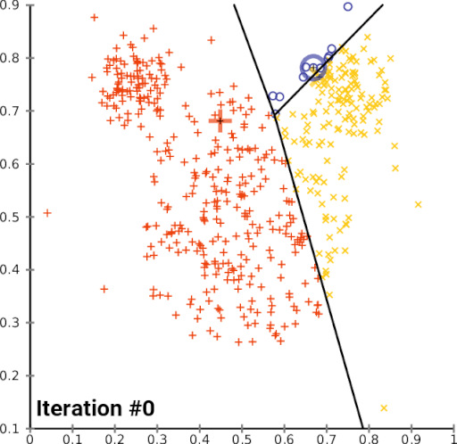
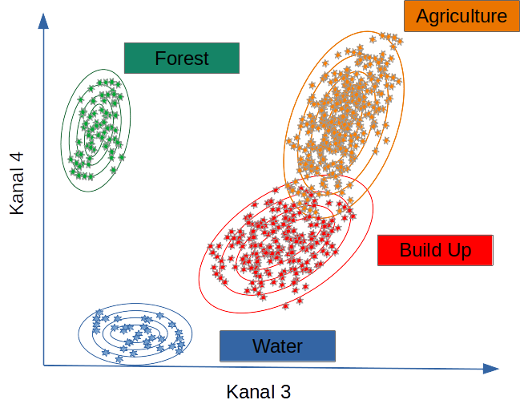
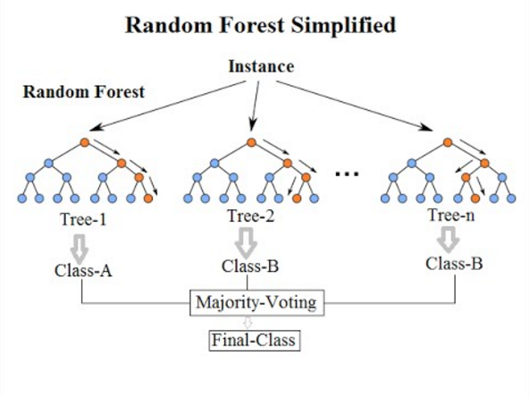

# Introduction

Remote sensing is the only measurement technology that enables continuous observation of the Earth’s surface across full spatial extents — from landscapes to entire countries and global regions.
To use remote sensing effectively, it is essential not only to apply established analytical methods but also to adapt and extend them as new environmental questions and large datasets emerge.

Sentinel-2 is currently the most important platform for Earth observation in all areas, but especially for climate change, land use and ecological issues at all levels, from the upper micro to the global scale.

There are two operational Sentinel-2 satellites: Sentinel-2A and Sentinel-2B, both in sun-synchronous polar orbits and 180 degrees out of phase. This arrangement allows them to cover the mid-latitudes with an orbital period of about 5 days.

The Sentinel-2 data are therefore predestined to record spatial and temporal changes on the Earth's surface (the forest was green in early summer, it has disappeared by late summer). They are ideal for timely studies before and after natural disasters, or for biomass balancing, although complementary systems such as Landsat-8/9 (long-term continuity), PlanetScope (daily repeat), or Sentinel-1 SAR (cloud-penetrating structural information) are also operationally important; nevertheless, Sentinel-2 remains the most widely used because it uniquely combines global free access, high radiometric quality, a consistent 10–20 m multispectral design, and a reliably maintained 5-day revisit cycle.

Change detection and time-series analysis are central in environmental informatics because most Earth-surface processes — drought-induced forest dieback, land-use conversion, vegetation dynamics, bark-beetle outbreaks, flooding, and climate impacts — unfold simultaneously across space and time.

A robust spatial-temporal workflow therefore requires:

1. Acquiring Sentinel satellite data,
2. Extracting spectral and structural information, and
3. Applying classification and temporal analysis methods to quantify and interpret changes.

The following sections outline the conceptual foundations of image-based change detection and demonstrate how classification, spectral indices and Sentinel-2 data together reveal spatial-temporal patterns.
The Burgwald serve as examples of vegetation change between 2018 and 2023.
For a broader conceptual framework of GIScience and remote sensing as components of system-based spatial information science, see @tolpekin2012.

# Change Detection and Spatial–Temporal Analysis {#change-overview}

Unprocessed Sentinel-2 imagery is rich in information, but not immediately meaningful.
While humans can interpret true-color scenes intuitively, scientific interpretation requires quantitative methods.
The strength of remote-sensing analysis lies in deriving information that is invisible to the naked eye: vegetation health, stress, canopy density, moisture content, structural changes, and land-cover transitions.

### Vegetation indices

Spectral vegetation indices are dimensionless, mathematically defined combinations of Sentinel-2 bands that compress multi-band reflectance into a few variables targeted at specific biophysical properties of the land surface. By using ratios, differences or more complex transforms of visible, red-edge, NIR and SWIR bands, they enhance signals related to chlorophyll content, canopy density and structure, leaf water status, or exposed soil background while suppressing illumination and atmospheric effects. Because no single raw band can reliably isolate these processes, spectral indices are a crucial intermediate layer between radiance/reflectance data and higher-level products such as land-cover classes, crop types, or degradation maps. In practice, remote-sensing workflows therefore rely heavily on vegetation and moisture indices (e.g. NDVI, EVI, SAVI, red-edge-based indices, NDWI/NDMI) as input features for time-series analysis, change detection and machine-learning classification, particularly when exploiting the rich spectral sampling of Sentinel-2’s red-edge and SWIR bands [@bannari1995; @xue2017; @huang2020; @montero2023].

The Normalized Difference Vegetation Index (NDVI) measures chlorophyll absorption in red vs. near-infrared reflectance and is a fundamental indicator of greenness, photosynthetic activity, and canopy density. NDVI is the most widely used vegetation index, but also frequently misinterpreted or over-generalised [@huang2020]. The Modified Soil Adjusted Vegetation Index (MSAVI2) reduces soil-brightness influence in sparse or partially damaged canopies, making it useful in drought-affected stands and early dieback where soil background is exposed. The Moisture Stress Index (MSI), derived from the SWIR/NIR ratio, is sensitive to water loss and canopy desiccation and often serves as an early-warning indicator before visual decline or NDVI reductions become apparent. The Soil Adjusted Vegetation Index (SAVI) explicitly accounts for soil reflectance in mixed pixels and is highly effective in clearcuts, forest edges, young regrowth and partially disturbed sites. The Enhanced Vegetation Index (EVI) reduces atmospheric scattering effects and mitigates NDVI saturation in dense canopies, which is particularly important in dense conifer forests and for monitoring spruce dieback with Sentinel-2 [@bannari1995; @xue2017].

These indices serve as continuous measures of canopy condition, moisture content, and structural state. When combined with classification, they provide the physical basis required to interpret spatial-temporal change patterns.

### Structural and textural descriptors

Structural and textural descriptors capture how reflectance values are arranged in space, rather than their absolute value in a single pixel.
In remote sensing, they typically quantify local neighbourhood patterns (for example via grey-level co-occurrence matrices, local binary patterns, Gabor filters or wavelets) or higher-level structure such as object shape, size, orientation and canopy architecture [@fekriershad2018].
These descriptors become particularly important in high-resolution imagery and heterogeneous landscapes, where many land-cover types may be spectrally similar but differ in spatial pattern — for example forest vs. shrubland, tiled roofs vs. asphalt, or dense vs. sparse crowns.
Modern classification workflows therefore often combine spectral indices with structural/textural features to form joint spatial–spectral feature sets, which have been shown to improve land-cover mapping, change detection and fine-grained object recognition in multispectral and hyperspectral data [@datta2022; @mehmood2022; @li2024; @wang2025].

### Classification logic: MLC, k-means, Random Forest {#classification-logic}

From a methodological perspective, three families of classifiers illustrate the logic from classical statistics through unsupervised clustering to modern ensemble learning: Maximum Likelihood Classification (MLC), k-means clustering, and Random Forest (RF). Together, these three methods illustrate the progression from distribution-based decision rules (MLC), via geometry-based partitioning (k-means), to data-driven ensemble learning (RF) that is now standard in remote-sensing workflows and frequently used as a benchmark in comparative studies [@lu2007; @hogland2013; @paradis2022; @belgiu2016].

#### 1. K-means (Unsupervised Clustering) {#kmeans}

K-means is an unsupervised clustering algorithm that partitions pixels into k clusters by iteratively minimising within-cluster variance. It is simple, fast and requires no labelled training data, but has no notion of semantic classes, is sensitive to initialisation and scale, and ignores spatial context. In land-cover workflows, it is therefore mainly used for exploratory grouping or as a pre-step before manual labelling rather than as a final map [@paradis2022].

K-means is often considered the most accessible unsupervised classification algorithm. It groups pixels solely by spectral similarity, without requiring training data, making it ideal for exploratory analysis. Each pixel is an observation in multidimensional feature space. The algorithm assigns each pixel to the nearest cluster centroid, iteratively adjusting centroid positions until convergence.

{fig-cap="K-means convergence (animated, HTML only)"}

*Convergence of k-means clustering from an unfavourable starting position (two initial cluster centres are fairly close).*

In vegetation-change studies, k-means is used to check whether classes like forest, dead wood, and clearcuts are spectrally distinct — an essential requirement for stable supervised classification.

#### 2. Maximum Likelihood Classification (MLC) {#mlc}

Maximum Likelihood Classification (MLC) is a parametric supervised classifier that assumes each class follows a multivariate normal distribution in feature space. It assigns each pixel to the class with the highest posterior probability given class means, covariance matrices and, optionally, class priors. MLC works well when classes are spectrally compact and approximately Gaussian, but degrades for heterogeneous or non-Gaussian classes [@hogland2013].

MLC assumes that each class follows a multivariate normal distribution in spectral (or feature) space. It computes the probability that a pixel belongs to each class and assigns it to the most likely one. Performance is strongly influenced by the covariance structure of the classes and by how well the training data represent within-class variability [@hogland2013].

MLC performs well when spectral differences between classes (for example, forest vs. clearcut) are large and the Gaussian assumption is approximately valid.

Classifiers such as MLC use training data to determine descriptive models representing statistical signatures. Within the limits of the quality and representativeness of the training data, such models can be applied to all pixels for which the predictor variables are available [@lu2007; @belgiu2016].

#### 3. Random Forest Classification (RF) {#rf}

Random Forest (RF) is a non-parametric supervised ensemble approach. Many decision trees are trained on bootstrapped samples and random subsets of features, and predictions are aggregated by majority vote (classification) or averaging (regression). RF can model complex, non-linear class boundaries, handles mixed feature sets (spectral indices, structural/textural descriptors, ancillary GIS layers), and is relatively robust to noise and unbalanced data [@belgiu2016].

Random Forest builds an ensemble of decision trees, each learning different feature partitions. A pixel is classified via majority vote across all trees. RF excels in complex, heterogeneous landscapes because it handles nonlinear relationships, high-dimensional predictors (bands plus indices plus structural/textural descriptors), correlated variables, and spectral noise and outliers.

Random Forest is now considered a baseline method in environmental machine learning, alongside Gradient Boosting and Support Vector Machines, particularly for land-cover mapping and change detection [@belgiu2016; @mehmood2022].

In this tutorial, Random Forest is used to predict the spatial distribution of clear-felling/no forest alongside MLC, combined with standard methods of random validation and model quality assessment. Both methods are widely used in forestry, agriculture, urban studies, ecosystem monitoring, and climate-change research.

## Combining Spectral, Structural, and Classification Features

In practice, many workflows **combine** three types of information:

- Spectral indices (NDVI, MSAVI2, MSI, SAVI, EVI, kNDVI),
- Structural or textural descriptors, and
- Classification models (unsupervised and supervised).

However, this is a *design choice*, not a universal requirement. Brute-force experiments and feature-selection studies show that classification performance depends strongly on the **correlation structure and composition of the predictor set** rather than on simply “using everything” [@lu2007; @mehmood2022]. Highly collinear indices can dilute model signal, and some feature types become redundant once others are included.

A common strategy is therefore to derive structural or textural descriptors not on every individual band, but on a **reduced spectral subspace**, for example on the first principal component of an energy-rich band stack (e.g. red–NIR–SWIR). This preserves most spatial structure while limiting dimensionality and redundancy. In many Random Forest applications, the most important splits still come from raw spectral bands or a few key indices, with texture contributing mainly in cases where **spatial pattern** (patchiness, edge density, canopy roughness) matters more than pure reflectance [@belgiu2016; @datta2022]. For RGB-only data, by contrast, spatial/structural features and RGB-based indices often carry a larger fraction of the discriminative information.

Equally important is that model training and feature selection are **spatially explicit**. Spatial autocorrelation and clustered sampling can cause over-optimistic accuracies and misleading variable importance. Target-oriented spatial cross-validation and forward feature selection, as implemented for example in the CAST framework, explicitly account for prediction geometry and help to remove predictors that only exploit spatial structure instead of genuine environmental relationships [@meyer2018; @meyer2019; @meyer_pebesma2021; @meyer_pebesma2022; @cast]. In other words, the “best” combination of spectral, structural and ancillary predictors is **task- and data-specific** and must be derived under an appropriate spatial validation scheme.

Additionally, long-term studies increasingly rely on cloud-native geospatial techniques, such as STAC catalogues, COGs, and distributed computing via gdalcubes [@gdalcubes], rstac [@rstac], or openeo [@openeo].
These approaches are essential when analyses scale to hundreds of scenes or multiple years.

## Assessing Classification Quality {#validation}

Supervised classification requires validation, usually by splitting data into training and test subsets or by using independent reference data.
Performance metrics include:

- Sensitivity (true positive rate for clearcuts),
- Specificity (true negative rate for non-clearcuts),
- Predictive values, adjusting for actual class frequencies, and
- Global measures such as overall accuracy and Cohen’s kappa.

Even high accuracy may mask structural misclassification in subtle transitions, such as thinning canopies or partially damaged stands.

Continuous spectral indices such as kNDVI — derived using the gdalcubes framework — help diagnose such errors by revealing sub-pixel gradients that discrete classes cannot capture.

Advanced time-series methods like BFAST [@bfast; @bfast_rs2020] breakpoints in vegetation dynamics, including timing and magnitude of structural change.
BFAST is particularly valuable in drought–forest interactions and post-disturbance recovery monitoring.

## Digitising Training Data {#training-data}

Training data must represent all land-cover types to be classified.
Digitisation can be done interactively in R (for example with **mapedit**) or externally in QGIS:

<https://docs.qgis.org/3.34/en/docs/training_manual/create_vector_data/create_new_vector.html#basic-ty-digitizing-polygons>

After digitisation, raster values for all predictors (bands, indices, structural descriptors) are extracted for each polygon and used to train the classifier.

Best practices include:

- Ensuring balanced class representation,
- Avoiding polygons that span multiple land-cover types, and
- Using high-resolution aerial imagery to refine training locations.

## Further Reading {#references-reading}

### Technical tutorials & blogs

These resources are **practical, implementation-focused** guides.
They are useful to understand concrete R workflows, but they do **not** replace primary literature or your own methodological reasoning.

- **Goldstein, S. (2019).** Classifying satellite imagery in R. *Urban Spatial Blog*. <https://urbanspatial.github.io/classifying_satellite_imagery_in_R/> [@goldstein2019]

- **Hijmans, R. J. (2023).** Supervised classification. rspatial.org. <https://rspatial.org/raster/rs/5-supclassification.html> [@hijmans2023]

- **Lizarazo, I. (2021).** A tutorial on pixel-based land cover classification using random forests in R. RPubs. <https://rpubs.com/ials2un/rf_landcover> [@lizarazo2021]

- **Gonçalves, J. (2018).** Advanced techniques with raster data: Supervised classification. R-exercises. <https://www.r-exercises.com/2018/03/07/advanced-techniques-with-raster-data-part-2-supervised-classification/> [@goncalves2018]

- **Stefan, V. (2020).** Satellite image classification in R. <https://valentinitnelav.github.io/satellite-image-classification-r/> [@stefan2020]

::: {.callout-tip title="About blog posts and tutorials..." appearance="simple"}
Use tutorials and blog posts as practical support only.
They are extremely helpful for code and workflow patterns, but they cannot replace independent thinking, methodological scrutiny, or engagement with peer-reviewed research.
:::

## Final Remarks {#final}

This tutorial integrates both conventional and cloud-based processing paradigms.
Traditional workflows download individual Sentinel scenes and process them locally.
Cloud-native methods use STAC catalogues, COGs, and distributed computation (for example gdalcubes, rstac, openeo) to build scalable workflows for long time series and large spatial extents.

For cloud-native methods see:

- <https://gdalcubes.github.io/source/tutorials/>
- <https://openeo.org/>
- <https://open-eo.github.io/openeo-r-client/>

Both paradigms remain relevant.
Local processing supports transparency, teaching, and technical fundamentals.
Cloud-native processing is essential for scaling to continental or multi-year analyses.

# References
