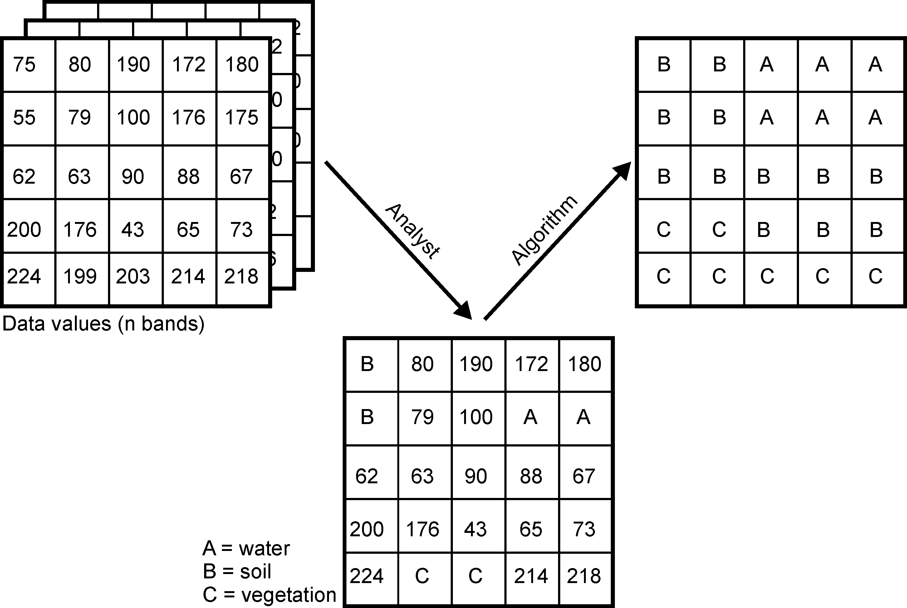

Remote sensing is the only measurement technology that enables continuous observation of the Earth’s surface across full spatial extents — from landscapes to entire countries and global regions.
To use remote sensing effectively, it is essential not only to apply established analytical methods but also to adapt and extend them as new environmental questions and large datasets emerge.

Change detection and time-series analysis are central in environmental informatics because most Earth-surface processes — drought-induced forest dieback, land-use conversion, vegetation dynamics, bark-beetle outbreaks, flooding, and climate impacts — unfold simultaneously across space and time.
A robust spatial-temporal workflow therefore requires:

1. Acquiring Sentinel satellite data,
2. Extracting spectral and structural information, and
3. Applying classification and temporal analysis methods to quantify and interpret changes.

The following sections outline the conceptual foundations of image-based change detection and demonstrate how classification, spectral indices and Sentinel-2 data together reveal spatial-temporal patterns.
The Burgwald and Northwest Harz serve as examples of dramatic vegetation change between 2018 and 2023.

---

# Change Detection and Spatial–Temporal Analysis {#change-overview}

Unprocessed Sentinel-2 imagery is rich in information, but not immediately meaningful.
While humans can interpret true-color scenes intuitively, scientific interpretation requires quantitative methods.
The strength of remote-sensing analysis lies in deriving information that is invisible to the naked eye: vegetation health, stress, canopy density, moisture content, structural changes, and land-cover transitions.

Change detection relies on identifying spectral signatures that evolve over time.
These signatures become interpretable only when spectral time series are classified, differenced, or modelled, and when these results are placed within their biophysical context.

Most workflows therefore combine:

* Spectral indices (NDVI, MSAVI2, MSI, SAVI, EVI, kNDVI),
* Structural or textural descriptors, and
* Classification (unsupervised or supervised).

This combination is necessary because classification alone cannot describe continuous vegetation processes, and spectral indices alone cannot distinguish discrete land-cover classes.

Additionally, long-term studies increasingly rely on cloud-native geospatial techniques, such as STAC catalogues, COGs, and distributed computing via gdalcubes, rstac, or openeo.
These approaches are essential when analyses scale to hundreds of scenes or multiple years.

---

# Spectral Indices: Extracting Biophysical Signals {#spectral-indices}

Spectral vegetation indices are mathematical combinations of Sentinel-2 bands designed to isolate specific plant or soil properties.
They are essential precursors to classification because they reveal biophysical processes that no single raw band can capture.

Remote-sensing analysis frequently relies on the following vegetation and moisture indices:

## NDVI

Normalized Difference Vegetation Index (NDVI)
[https://www.indexdatabase.de/db/i-single.php?id=58](https://www.indexdatabase.de/db/i-single.php?id=58)

Measures chlorophyll absorption in red vs. near-infrared reflectance.
A fundamental indicator of greenness, photosynthetic activity, and canopy density.

## MSAVI2

Modified Soil Adjusted Vegetation Index (MSAVI2)
[https://www.indexdatabase.de/db/i-single.php?id=44](https://www.indexdatabase.de/db/i-single.php?id=44)

Reduces soil-brightness influence in sparse or partially damaged canopies.
Useful in drought-affected stands and early dieback.

## MSI

Moisture Stress Index (MSI)
[https://www.indexdatabase.de/db/i-single.php?id=48](https://www.indexdatabase.de/db/i-single.php?id=48)

Derived from SWIR/NIR ratio.
Sensitive to water loss and canopy desiccation — often an early-warning indicator before visual decline.

## SAVI

Soil Adjusted Vegetation Index (SAVI)
[https://www.indexdatabase.de/db/i-single.php?id=87](https://www.indexdatabase.de/db/i-single.php?id=87)

Explicitly accounts for soil reflectance in mixed pixels.
Highly effective in clearcuts, forest edges, young regrowth, and partially disturbed sites.

## EVI

Enhanced Vegetation Index (EVI)
[https://www.indexdatabase.de/db/i-single.php?id=16](https://www.indexdatabase.de/db/i-single.php?id=16)

Reduces atmospheric scattering effects.
Avoids NDVI saturation in dense conifer forests (important for spruce dieback monitoring).

These indices serve as continuous measures of canopy condition, moisture content, and structural state.
When combined with classification, they provide the physical basis required to interpret spatial-temporal change patterns.

---

# Unsupervised Classification (K-means Clustering) {#kmeans}

K-means is often considered the most accessible unsupervised classification algorithm.
It groups pixels solely by spectral similarity, without requiring training data, making it ideal for exploratory analysis.

Each pixel is an observation in multidimensional feature space.
The algorithm assigns each pixel to the nearest cluster centroid, iteratively adjusting centroid positions until convergence.

The animation below illustrates this process:

{fig-cap="K-means: Konvergenz (animiert, nur HTML)"}

Source: [https://commons.wikimedia.org/wiki/File:K-means_convergence.gif](https://commons.wikimedia.org/wiki/File:K-means_convergence.gif) (Chire, CC BY-SA 4.0)

*Convergence of k-means clustering from an unfavorable starting position (two initial cluster centers are fairly close*

In vegetation-change studies, k-means is used to check whether classes like forest, dead wood, and clearcuts are spectrally distinct — an essential requirement for stable supervised classification.

---

# Supervised Classification {#supervised}

Classifiers (e.g. the maximum likelihood classifier) or machine learning algorithms (such as Random Forest) use the training data to determine descriptive models that represent statistical signatures, classification trees or other functions. Within the limits of the quality of the training data, such models are suitable and representative for making predictions for areas if the predictors from the model are available for the entire area.

We now want to predict the spatial characteristics of clear-felling/no forest using a maximum likelihood classification and random forest, and apply standard methods of random validation and model quality assessment.

Two methods dominate environmental remote sensing:

* Maximum Likelihood Classification (MLC)
* Random Forest Classification (RF)

Both are used extensively in forestry, agriculture, urban studies, ecosystem monitoring, and climate-change research.

## Maximum Likelihood Classification (MLC)

MLC assumes that each class follows a multivariate normal distribution in spectral space.
It computes the probability that a pixel belongs to each class and assigns it to the most likely one.

MLC performs well when spectral differences between classes (for example, forest vs. clearcut) are large.

## Random Forest Classification (RF)

Random Forest builds an ensemble of decision trees, each learning different feature partitions.
A pixel is classified via majority vote across all trees.

RF excels in complex, heterogeneous landscapes because it handles:

* Nonlinear relationships
* High-dimensional predictors (bands plus indices)
* Correlated variables
* Spectral noise and outliers

Random Forest is now considered a baseline method in environmental machine learning, alongside Gradient Boosting and Support Vector Machines.

# Assessing Classification Quality {#validation}

Supervised classification requires validation, usually by splitting data into training and test subsets.
Performance metrics include:

* Sensitivity (true positive rate for clearcuts)
* Specificity (true negative rate for non-clearcuts)
* Predictive values, adjusting for actual class frequencies

Even high accuracy may mask structural misclassification in subtle transitions, such as thinning canopies.

Continuous spectral indices such as kNDVI — derived using the gdalcubes framework — help diagnose such errors.

Advanced time-series methods like BFAST identify breakpoints in vegetation dynamics, including timing and magnitude of structural change.

BFAST is particularly valuable in drought–forest interactions and post-disturbance recovery monitoring.

---

# Digitising Training Data {#training-data}

Training data must represent all land-cover types to be classified.
Digitization can be done interactively in R (for example with mapedit) or externally in QGIS.

[https://docs.qgis.org/3.34/en/docs/training_manual/create_vector_data/create_new_vector.html#basic-ty-digitizing-polygons](https://docs.qgis.org/3.34/en/docs/training_manual/create_vector_data/create_new_vector.html#basic-ty-digitizing-polygons)

After digitization, raster values for all predictors (bands and indices) are extracted for each polygon and used to train the classifier.

Best practices include:

* Ensuring balanced class representation
* Avoiding polygons that span multiple land-cover types
* Using high-resolution aerial imagery to refine training locations

---

# Further Reading {#references-reading}

The Core of GIScience (Tolpekin and Stein 2012)
[http://www.charim.net/sites/default/files/handbook/datamanagement/3/3.3/The%20core%20of%20GIScience%2C%20a%20system%20-based%20approach.pdf](http://www.charim.net/sites/default/files/handbook/datamanagement/3/3.3/The%20core%20of%20GIScience%2C%20a%20system%20-based%20approach.pdf)

FTP mirror: ftp://ftp.itc.nl/pub/ders/CoreBook2014_metadata.pdf

Robert J. Hijmans – Supervised Classification
[https://rspatial.org/raster/rs/5-supclassification.html](https://rspatial.org/raster/rs/5-supclassification.html)

Ivan Lizarazo – Landcover Tutorial
[https://rpubs.com/ials2un/rf_landcover](https://rpubs.com/ials2un/rf_landcover)

Sydney Goldstein – Urban Spatial Blog
[https://urbanspatial.github.io/classifying_satellite_imagery_in_R/](https://urbanspatial.github.io/classifying_satellite_imagery_in_R/)

João Gonçalves – Supervised Classification
[https://www.r-exercises.com/2018/03/07/advanced-techniques-with-raster-data-part-2-supervised-classification/](https://www.r-exercises.com/2018/03/07/advanced-techniques-with-raster-data-part-2-supervised-classification/)

Valentin Stefan – Pixel-based Classification
[https://valentinitnelav.github.io/satellite-image-classification-r/](https://valentinitnelav.github.io/satellite-image-classification-r/)

Quoted remark:

“Consider this content a blog post and nothing more.
It does not claim to be an exhaustive exercise or a substitute for your critical thinking.”

---

# Final Remarks {#final}

This tutorial integrates both conventional and cloud-based processing paradigms.
Traditional workflows download individual Sentinel scenes and process them locally.
Cloud-native methods use STAC catalogues, COGs, and distributed computation (for example gdalcubes, rstac, openeo) to build scalable workflows for long time series and large spatial extents.

For cloud-native methods see:

[https://gdalcubes.github.io/source/tutorials/](https://gdalcubes.github.io/source/tutorials/)
[https://openeo.org/](https://openeo.org/)
[https://open-eo.github.io/openeo-r-client/](https://open-eo.github.io/openeo-r-client/)

Both paradigms remain relevant.
Local processing supports transparency, teaching, and technical fundamentals.
Cloud-native processing is essential for scaling to continental or multi-year analyses.
