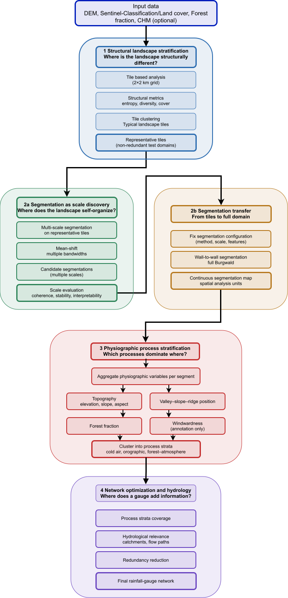

## Conceptual background and problem framing

The design of rainfall and hydrometric monitoring networks is fundamentally a **spatial design problem**. Landscapes are heterogeneous, monitoring resources are limited, and the target variables of interest—precipitation, runoff, and discharge—are governed by interacting processes operating across multiple spatial scales. Consequently, station placement cannot be reduced to uniform coverage or local optimisation, but must instead maximise **information gain with respect to hydrological response**.

Many existing approaches optimise station locations directly within predefined spatial units such as grids or catchments [@Mishra2009; @Alfonso2010; @Samuel2013]. While these approaches are hydrologically intuitive, they embed **implicit assumptions about spatial scale and internal homogeneity**, which are rarely satisfied in real landscapes [@Wagener2007].

The workflow adopted here explicitly separates **structural heterogeneity**, **segmentation-based scale discovery**, **physiographic process stratification**, and **hydrological optimisation** (Figure 1). This staged reduction of spatial complexity ensures that scale decisions remain explicit and that optimisation operates on process-relevant spatial units rather than raw spatial partitions.

  
---

## Catchment-based versus segment-based design

### Catchment-based design

Catchments are the natural spatial units of hydrology. They encode drainage connectivity, flow accumulation, and mass balance, and therefore form the backbone of many network design approaches [@Mishra2009; @Alfonso2010]. Optimisation within catchments provides a direct link between rainfall measurements and discharge observations at outlets.

However, catchment-based designs implicitly assume that catchments are internally homogeneous. Empirical and comparative hydrology studies demonstrate that even small catchments often exhibit multiple dominant runoff-generation mechanisms [@Wagener2007; @Sawicz2011]. As a result, station placement optimised at the catchment level may be hydrologically relevant at the outlet but **spatially blind** to internal process variability.

### Segment-based design

Segment-based approaches derive **data-driven spatial units** through adaptive segmentation or regionalisation. These units aim to be internally homogeneous and externally distinct with respect to selected variables. In remote sensing and spatial analysis, segmentation has long been treated as a **scale-space problem** rather than a classification task [@Blaschke2010; @Dragut2014].

Recent work on adaptive regionalisation and supercells shows that such units can be robust and reproducible when segmentation quality is evaluated quantitatively [@Nowosad2022]. Segment-based designs allow explicit control over spatial scale and can represent similar process settings across different catchments.

At the same time, segments do not encode hydrological connectivity and therefore cannot replace catchments as aggregation units. Used in isolation, segment-based designs risk ignoring flow paths and drainage hierarchy.

### Hybrid rationale

This thesis adopts a **hybrid position**: segments are used to represent spatial heterogeneity and discover meaningful scales, while catchments and stream networks are used for hydrological aggregation and evaluation. This sequencing follows calls in hydrology to decouple spatial representation from hydrological response analysis [@Winter2001; @Wagener2007].

---

## Methods

### Structural landscape stratification

The study area is partitioned into coarse, fixed spatial tiles. For each tile, structural landscape descriptors are derived from categorical land-cover data, including diversity and entropy-based measures [@Turner1989; @McGarigal2012]. These descriptors characterise landscape structure independently of physical processes.

Tiles are clustered into **structural strata**, reducing spatial redundancy prior to segmentation and optimisation.

### Representative test tiles

From each structural stratum, representative test tiles are selected based on distance-to-centroid criteria. Restricting segmentation experiments to these tiles improves computational efficiency and reproducibility while maintaining structural representativeness.

### Adaptive segmentation and scale discovery

Adaptive segmentation methods (e.g. mean-shift or supercell-based approaches) are applied to the test tiles across a range of parameter settings. Segmentation quality is evaluated using quantitative criteria such as segment size distributions, intra-segment homogeneity, inter-segment contrast, and stability under parameter perturbation [@Clinton2010; @Chen2018].

Rather than selecting a single optimal scale, segmentation configurations are evaluated in terms of **Pareto-optimal trade-offs**.

### Segmentation transfer and physiographic strata

A selected segmentation configuration is transferred wall-to-wall to the full study area. Physiographic attributes such as elevation, terrain position, and vegetation fraction are aggregated per segment and used to derive **physiographic process strata** [@Winter2001; @Sawicz2011].

### Hydrological context and network optimisation

Physiographic strata are overlaid with watershed boundaries and stream networks characterised by Strahler order [@Strahler1957]. Catchments serve as aggregation units to evaluate how different strata contribute to runoff at selected outlets.

Station placement is then optimised using information-theoretic criteria to maximise information gain and minimise redundancy [@Alfonso2010; @Samuel2013; @Keum2017].

---

## References
