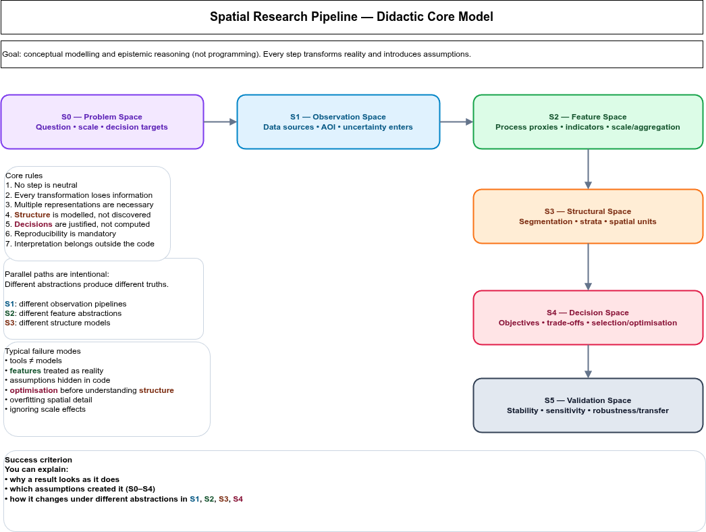

## Conceptual background and problem framing (S0)

The design of rainfall and hydrometric monitoring networks is fundamentally a **spatial design problem**.
Landscapes are heterogeneous, monitoring resources are limited, and the target variables of interest—precipitation, runoff, and discharge—are governed by interacting processes operating across multiple spatial scales.
Consequently, station placement cannot be reduced to uniform coverage or local optimisation, but must instead maximise **information gain with respect to hydrological response**.

Many existing approaches optimise station locations directly within predefined spatial units such as grids or catchments [@Mishra2009; @Alfonso2010; @Samuel2013].
While these approaches are hydrologically intuitive, they embed **implicit assumptions about spatial scale and internal homogeneity**, which are rarely satisfied in real landscapes [@Wagener2007].

To keep modelling assumptions explicit, this thesis separates the modelling task into two complementary frames:

1. a **didactic meta-model** that makes abstraction steps and epistemic roles explicit (Figure 1), and  
2. the **concrete Burgwald implementation pipeline** that operationalises these steps in a reproducible GIS/RS workflow (Figure 2).

This staged reduction of spatial complexity ensures that scale decisions remain explicit and that optimisation operates on process-relevant spatial units rather than raw spatial partitions.

### Conceptual modelling spaces (S0–S5)

The workflow is structured into a sequence of modelling spaces.
Each transition is a deliberate abstraction step: it reduces complexity and increases comparability, but introduces assumptions and information loss.

* **S0 — Problem Space:** design objectives, relevant scales, decision criteria.
* **S1 — Observation Space:** reproducible construction of spatial observations from heterogeneous data sources.
* **S2 — Feature Space:** derivation of abstract descriptors and process proxies.
* **S3 — Structural Space:** segmentation and stratification into discrete spatial units.
* **S4 — Decision Space:** optimisation and trade-off analysis for station placement.
* **S5 — Validation Space:** stability, sensitivity, robustness and transferability analysis.

Figure 1 serves as a navigation model for the remainder of this document.
Whenever sections refer to (S1–S5), they refer to the corresponding abstraction spaces in this meta-model.

### Concrete implementation pipeline (Burgwald)

The Burgwald workflow implements the same abstraction logic in a concrete processing chain.
In contrast to the didactic meta-model (Figure 1), the concrete pipeline makes explicit **which datasets enter the process**, **where segmentation is explored and fixed**, **how process strata are derived**, and **where optimisation is performed**.

In Figure 2, the numbered blocks are referenced explicitly in the Methods section to indicate where each methodological component operates in the end-to-end workflow.

## Catchment-based versus segment-based design (S0 → S3)

### Catchment-based design

Catchments are the natural spatial units of hydrology.
They encode drainage connectivity, flow accumulation, and mass balance, and therefore form the backbone of many network design approaches [@Mishra2009; @Alfonso2010].
Optimisation within catchments provides a direct link between rainfall measurements and discharge observations at outlets.

However, catchment-based designs implicitly assume that catchments are internally homogeneous.
Empirical and comparative hydrology studies demonstrate that even small catchments often exhibit multiple dominant runoff-generation mechanisms [@Wagener2007; @Sawicz2011].
As a result, station placement optimised at the catchment level may be hydrologically relevant at the outlet but **spatially blind** to internal process variability.

### Segment-based design

Segment-based approaches derive **data-driven spatial units** through adaptive segmentation or regionalisation.
These units aim to be internally homogeneous and externally distinct with respect to selected variables.
In remote sensing and spatial analysis, segmentation has long been treated as a **scale-space problem** rather than a classification task [@Blaschke2010; @Dragut2014].

Recent work on adaptive regionalisation and supercells shows that such units can be robust and reproducible when segmentation quality is evaluated quantitatively [@Nowosad2022].
Segment-based designs allow explicit control over spatial scale and can represent similar process settings across different catchments.

At the same time, segments do not encode hydrological connectivity and therefore cannot replace catchments as aggregation units.
Used in isolation, segment-based designs risk ignoring flow paths and drainage hierarchy.

### Hybrid rationale

This thesis adopts a **hybrid position**:
segments are used to represent spatial heterogeneity and discover meaningful scales, while catchments and stream networks are used for hydrological aggregation and evaluation.
This sequencing follows calls in hydrology to decouple spatial representation from hydrological response analysis [@Winter2001; @Wagener2007].

In modelling-space terms, segments operate in the **structural representation domain (S3)**, while catchments remain the **hydrological aggregation domain (S4/S5)**.
Their coupling preserves both spatial heterogeneity and process connectivity without conflating epistemic roles.

## Methods

> **Modelling perspective**
> This workflow does not aim to compute an “optimal” solution directly from raw space.
> It constructs a sequence of abstractions that progressively transform spatial complexity into a structured decision space.
> Each modelling layer introduces assumptions that remain transparent and contestable.
>
> In the concrete Burgwald workflow (Figure 2), these abstractions are operationalised as blocks (1–4), which are referenced below.

### Structural landscape stratification (S2 → S3; Figure 2, Block 1)

The study area is partitioned into coarse, fixed spatial tiles.
For each tile, structural landscape descriptors are derived from categorical land-cover data, including diversity and entropy-based measures [@Turner1989; @McGarigal2012].
These descriptors characterise landscape structure independently of physical processes.

Tiles are clustered into **structural strata**, reducing spatial redundancy prior to segmentation and optimisation.

This step deliberately abstracts from physical processes and treats landscape structure as a spatial descriptor, trading physical realism for stability and comparability.

### Representative test tiles (S3 — model reduction; Figure 2, Block 1)

From each structural stratum, representative test tiles are selected based on distance-to-centroid criteria.
Restricting segmentation experiments to these tiles improves computational efficiency and reproducibility while maintaining structural representativeness.

This is a controlled reduction of the search space: representativeness is retained while computation and parameter exploration become feasible.

### Adaptive segmentation and scale discovery (S3; Figure 2, Block 2a)

Adaptive segmentation methods (e.g. mean-shift or supercell-based approaches) are applied to the test tiles across a range of parameter settings.
Segmentation quality is evaluated using quantitative criteria such as segment size distributions, intra-segment homogeneity, inter-segment contrast, and stability under parameter perturbation [@Clinton2010; @Chen2018].

Rather than selecting a single optimal scale, segmentation configurations are evaluated in terms of **Pareto-optimal trade-offs**.

Segmentation replaces continuous spatial variability by discrete objects, reducing internal heterogeneity while introducing boundary uncertainty and scale dependency.

### Segmentation transfer and physiographic strata (S3 → S4; Figure 2, Blocks 2b and 3)

A selected segmentation configuration is transferred wall-to-wall to the full study area (Figure 2, Block 2b).
Once fixed, the segmentation becomes the spatial reference frame for subsequent aggregation and analysis.

Physiographic attributes such as elevation, terrain position, and vegetation fraction are aggregated per segment and used to derive **physiographic process strata** (Figure 2, Block 3) [@Winter2001; @Sawicz2011].

This step maps structural units into process-relevant strata: it trades pixel-level detail for segment-level interpretability and process comparability.

### Hydrological context and network optimisation (S4; Figure 2, Block 4)

Physiographic strata are overlaid with watershed boundaries and stream networks characterised by Strahler order [@Strahler1957].
Catchments serve as aggregation units to evaluate how different strata contribute to runoff at selected outlets.

Station placement is then optimised using information-theoretic criteria to maximise information gain and minimise redundancy [@Alfonso2010; @Samuel2013; @Keum2017].

### Stability, sensitivity, and transferability (S5)

Network design outcomes are evaluated for robustness against:

* segmentation parameter perturbations,
* alternative feature abstractions,
* alternative stratification settings,
* and spatial transfer across subregions.

Validation targets stability of the *structural representation* and the *decision outcomes*, not the existence of a single “correct” spatial partition.

## References
