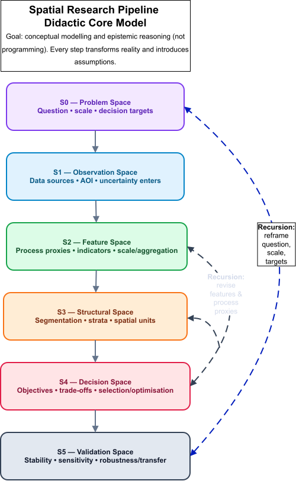
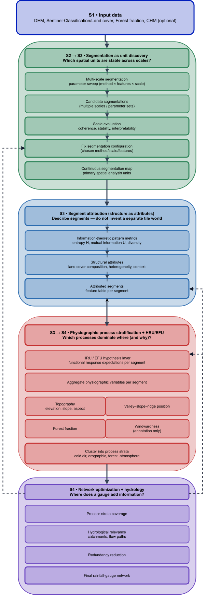

## Spatial units, process logic, and scale: theoretical grounding and epistemic recursion

::: {.callout-warning title="Why complexity explodes here (and why that is normal)" appearance="simple"}
At this point, the reader may feel as if complexity suddenly increases rather than decreases.
This is not a stylistic accident, and it is not a failure of the framework.
It is the normal consequence of moving from *spatial representation* to *process claims*.

Up to this point, many modelling choices can be framed as technical: segmentation quality, stability, interpretability, reproducibility.
The moment HRU/EFU logic, connectivity constraints, and scale–process mappings enter the argument, the same choices become epistemic.
A segment is no longer “just a unit”; it becomes a candidate for a functional claim.
A proxy is no longer “just a variable”; it becomes a hypothesis about mechanism.
And the catchment is no longer “just an overlay”; it becomes a constraint on what can meaningfully aggregate, propagate, and be evaluated.

This shift forces an explicit **recursive design logic**.
Later steps do not merely consume earlier outputs; they retroactively define what the earlier steps were *for*.
If process strata fail to produce interpretable or transferable patterns, this is not simply an optimisation problem — it can indicate that the segmentation scale, the attribution set, or the HRU/EFU interpretation layer was conceptually mis-specified.
In other words: once process logic is taken seriously, the workflow cannot remain a linear pipeline.

At the same time, the response to this necessary recursion is not to increase modelling breadth indefinitely.
Scientific progress typically increases complexity locally while tightening focus globally.
For network design, this means that recursion must be paired with explicit targeting: which precipitation signal, at which spatial and temporal scale, for which specific process linkage, and for which decision criterion.
Only under such focus can the framework use recursion to reduce ambiguity rather than amplify it.
:::

Any monitoring-network design implicitly commits to a spatial ontology: measurements are assumed to represent *something* — a spatial unit, a functional configuration, or a process regime.
In hydrology, this commitment is often left implicit, although it fundamentally determines what kind of information a network can resolve and what remains structurally invisible [@Winter2001; @Wagener2007].

Three families of spatial units dominate hydrological practice and provide complementary but incomplete representations of hydrologic space.

**Catchments and subbasins** encode lateral connectivity, routing, and mass balance by construction.
They therefore constitute the canonical aggregation units for discharge prediction and for network design approaches that optimize outlet performance [@Mishra2009; @Alfonso2010; @Samuel2013].
Their strength is topological consistency; their weakness is conceptual: catchments are rarely internally homogeneous with respect to runoff generation, storage dynamics, or threshold behaviour, even at small spatial extents [@Wagener2007; @Sawicz2011].
In practice, unresolved internal heterogeneity is often absorbed through catchment-specific calibration, producing equifinality and weak identifiability, where acceptable outlet fits coexist with structurally implausible parameterizations (“right answers for the wrong reasons”) [@BevenBinley1992; @Beven2006; @LiuGupta2007; @Kelleher2017].

**Hydrologic Response Units (HRUs)** were introduced to explicitly address this limitation by subdividing catchments into GIS-derived response patches based on terrain, soils, and land cover [@Flugel1995].
HRUs improve within-catchment differentiation and interpretability, but they remain primarily cartographic constructs: connectivity and lateral interaction are usually inherited from the surrounding subbasin structure rather than encoded in the units themselves.

**Elementary or functional units (EFUs)** generalize the HRU logic toward explicitly process-organized and often hierarchical entities.
Rather than representing spatial similarity alone, EFUs are intended to correspond to functional configurations in which dominant mechanisms are expected to operate and to be observable (e.g., hillslope elements, interfaces, threshold-controlled source areas) [@Zehe2014].
EFUs thus shift the unit concept from spatial partitioning toward mechanistic expectation and hypothesis testing.

In parallel, hydrologic landscape classifications and regionalizations pursue reproducible typologies across larger extents by grouping landscapes according to physiographic and climatic controls that co-vary with hydrologic response [@Winter2001; @Wolock2004; @Gharari2011].
These approaches emphasize functional similarity across space rather than local routing structure, further reinforcing the notion of hydrologic space as a set of repeatable functional settings.

From the spatial-analysis perspective, adaptive segmentation and regionalization provide **data-driven, scale-controlled spatial units** with quantitative quality assessment and reproducibility [@Blaschke2010; @Dragut2014; @Nowosad2022].
Conceptually, this is closely aligned with the HRU/EFU rationale, but without inherent hydrological semantics or connectivity constraints.

None of these unit families alone is sufficient for measurement-network design aimed at resolving process–scale relationships.
Catchments preserve connectivity but obscure internal heterogeneity; HRUs and EFUs represent heterogeneity and process expectations but weakly encode routing; segmentation provides reproducible scale control but lacks hydrological meaning unless explicitly coupled.
A hybrid representation is therefore required in which unit concepts are combined without conflating their epistemic roles.

### Structure–process coupling and the mediating role of connectivity

Landscape structure constrains hydrological processes by shaping energy balance, storage capacity, flow pathways, and threshold behaviour [@Winter2001; @Zehe2014].
Conversely, hydrological processes reorganize effective structure through transient connectivity, preferential flow paths, and event-dependent activation of landscape elements.
Purely structural discretizations capture spatial similarity but do not guarantee process relevance.
Purely process-oriented units presuppose mechanistic knowledge that may not be directly observable or transferable.

Connectivity mediates between these domains.
Drainage topology and network position determine how local process expressions propagate and aggregate.
Unit systems that ignore connectivity struggle to represent interactions such as hillslope–riparian coupling or threshold-controlled source areas, motivating recent attempts to reintroduce landscape routing concepts into unit-based models [@Wagner2022].

In the proposed framework, segmentation provides controlled structural granularity, HRU/EFU logic provides functional interpretation, and catchment topology constrains admissible aggregation and information flow.
Connectivity is therefore treated as a structural constraint on admissible unit combinations rather than as a decorative overlay.

### Scale as an explicit design variable

Scale is not a single quantity but a family of interacting dimensions:

- **Measurement scale** (sensor footprint and temporal integration),
- **Field scale** (spatial correlation and variability of precipitation and forcing),
- **Process scale** (characteristic extent of dominant mechanisms),
- **Aggregation scale** (domain of evaluation and routing).

Hydrological misinterpretation often arises when these scales are implicitly conflated [@Wagener2007; @Sawicz2011].
Segmentation primarily controls structural and field-scale representation.
HRU/EFU concepts relate these representations to hypothesized process scales.
Catchments define aggregation scale and connectivity constraints.

Rather than attempting to identify a single “correct” scale, the framework explicitly maps segmentation-derived structural scales onto process hypotheses and evaluates their stability and transferability.

### Epistemic recursion and didactic implication

At this point, the workflow logic deliberately loops back onto its own conceptual foundations.
The didactic meta-model and the concrete implementation pipeline initially serve as scaffolding to prevent methodological overload and to make abstraction steps explicit.
However, once the operational workflow is understood, it becomes necessary to re-enter the theoretical layer: spatial units, process assumptions, and scale choices must now be critically examined and justified.

For students, this recursion marks the transition from procedural execution to conceptual responsibility.
Initial project designs, which may have treated segmentation, stratification, and optimisation as technical steps, must now be revisited in light of hydrological unit theory, process logic, and scale coupling.
The framework therefore functions not only as a workflow template, but as an instrument for reflective model critique and redesign.

This recursive coupling between theory, abstraction, and implementation is intentional and constitutes a central learning objective of the project-based format.

## Conceptual background and problem framing (S0)

The conceptualization of networks for the purpose of rainfall and hydrometric monitoring constitutes, in essence, a **spatial design problem** of considerable complexity.
Landscapes are heterogeneous, monitoring resources are limited, and the target variables of interest—precipitation, runoff, and discharge—are governed by interacting processes operating across multiple spatial scales.
Therefore, station placement cannot be reduced to uniform coverage or local optimisation; rather, it must maximize information gain with respect to hydrological response.

Many existing approaches optimize station locations directly within predefined spatial units, such as grids or catchments [@Mishra2009; @Alfonso2010; @Samuel2013].
While these approaches are hydrologically intuitive, they embed **implicit** assumptions about spatial scale and internal homogeneity, which are rarely satisfied in real landscapes and process patterns [@Wagener2007].

In order to maintain transparency regarding the assumptions underlying the model, this thesis separates the overall problem into two complementary frames:

1.  A **didactic meta-model** that makes abstraction steps and epistemic roles explicit ([see figure 1](#figure-1)).\
2.  A **concrete implementation pipeline** (Burgwald) that operationalizes these steps in a reproducible GIS/RS workflow ([see figure 2](#figure-2)).

This staged reduction of spatial complexity ensures that scale decisions remain explicit and that optimization operates on process-relevant spatial units rather than raw spatial partitions.

## Conceptual background and problem framing (S0)

The conceptualization of networks for rainfall and hydrometric monitoring constitutes a **spatial design problem** under strong structural and epistemic constraints.
Landscapes are heterogeneous, monitoring resources are limited, and the target variables — precipitation, runoff, and discharge — are governed by interacting processes operating across multiple spatial scales.
Station placement therefore cannot be reduced to uniform coverage or purely local optimisation, but must maximize information with respect to identifiable hydrological mechanisms and their spatial organization.

Most existing network-design approaches optimize station locations within predefined spatial units such as grids or catchments [@Mishra2009; @Alfonso2010; @Samuel2013].
While hydrologically intuitive, these approaches embed implicit assumptions about scale, homogeneity, and process aggregation that are rarely satisfied in real landscapes [@Wagener2007].
In particular, outlet-oriented optimisation risks suppressing internal process diversity through calibration effects and equifinality [@BevenBinley1992; @Beven2006].

To avoid collapsing these assumptions into hidden technical choices, the framework explicitly separates **conceptual reasoning, structural abstraction, and operational optimisation**.
This separation is implemented through two complementary representations:

1. A **didactic meta-model** that formalizes abstraction spaces and epistemic roles ([Figure 1](#figure-1)).  
2. A **concrete implementation pipeline** (Burgwald) that operationalizes these abstractions in a reproducible workflow ([Figure 2](#figure-2)).

Crucially, these representations are not linear recipes but elements of a **recursive design logic**: operational choices must repeatedly be confronted with their theoretical implications regarding spatial units, processes, and scale.

### Conceptual modelling spaces (S0–S5)

The modelling framework is structured into a sequence of abstraction spaces.
Each transition reduces complexity while introducing explicit assumptions that remain open to critique and revision.

- **S0 — Problem Space**: Design objectives, target processes, relevant scales, evaluation criteria.
- **S1 — Observation Space**: Reproducible construction of spatial observations from heterogeneous sources.
- **S2 — Feature Space**: Derivation of abstract descriptors and process proxies.
- **S3 — Structural Space**: Construction of spatial units through segmentation and stratification.
- **S4 — Decision Space**: Candidate generation, constraint formulation, and optimisation.
- **S5 — Validation Space**: Stability, sensitivity, robustness, and transferability analysis.

{#figure-1}

The purpose of this meta-model is not methodological prescription, but epistemic transparency: it exposes where assumptions enter the modelling chain and where alternative choices remain admissible.

### Concrete implementation pipeline (Burgwald)

The Burgwald pipeline implements the same abstraction logic in a concrete processing chain.
In contrast to the meta-model, it makes explicit:

- which datasets enter the workflow,
- where segmentation is explored and fixed,
- how process-relevant strata are derived,
- where optimisation and validation occur.

{#figure-2}

The pipeline is intentionally modular: individual blocks can be replaced or refined without collapsing the overall epistemic structure.
This modularity enables the recursive re-entry of theoretical considerations into technical design decisions.

## Hydrological unit concepts and their operational roles

Spatial units serve different epistemic functions within the framework and must not be conflated.

- **Catchments** encode connectivity and aggregation logic and therefore constrain admissible signal propagation and evaluation.
- **HRUs** represent internally similar response patches within catchments [@Flugel1995].
- **EFUs** generalize HRUs toward explicitly process-organized functional entities [@Zehe2014].
- **Segments** provide scale-controlled, data-driven structural units with quantitative reproducibility [@Blaschke2010; @Dragut2014; @Nowosad2022].

Within the workflow, these unit concepts occupy distinct roles rather than competing alternatives:

- Segments provide the **structural substrate** in S3.
- HRU/EFU logic provides the **functional interpretation layer** that maps segments to process hypotheses in S3→S4.
- Catchments impose **connectivity constraints and aggregation logic** in S4/S5.

This separation allows hybridization without epistemic collapse: structural regularity, functional meaning, and network topology remain explicitly distinguishable.

## Process–structure–scale synthesis (design logic)

Hydrological processes are conditioned by landscape structure but cannot be reduced to it.
Structural proxies (topography, vegetation, exposure, soils) constrain energy balance, storage capacity, and connectivity patterns [@Winter2001; @Zehe2014].
Conversely, hydrological processes reorganize effective structure through transient connectivity and threshold activation.

Segmentation captures structural similarity and scale regularization but is agnostic to process meaning.
HRU/EFU concepts embed mechanistic expectations but require spatial instantiation and scale control.
Catchments preserve connectivity but suppress internal differentiation.

The hybrid framework explicitly couples these dimensions:

- **Structure → Process**: segments are interpreted through HRU/EFU logic using physiographic predictors and process hypotheses.
- **Process → Structure**: process expectations constrain admissible segmentation scales and aggregation choices.
- **Connectivity** constrains how structural–functional units can meaningfully interact and propagate signals.

Scale is treated as an explicit design variable rather than an implicit artifact.
Structural scale (segmentation), process scale (HRU/EFU interpretation), measurement scale (sensor footprint), and aggregation scale (catchments) are mapped and tested for compatibility.

## The Methods

::: {.callout-tip title="Modeling Perspective" appearance="simple"}
The workflow does not compute an "optimal" solution directly from raw space.
It constructs a sequence of abstractions that progressively transform spatial complexity into a constrained decision space.
Each abstraction introduces assumptions that remain explicit and contestable.
Recursive revisiting of these assumptions is an intended part of the methodology.
:::

### Structural landscape stratification (S2 → S3; Block 1)

The geographical area under consideration is divided into coarse, fixed spatial tiles.
For each tile, structural landscape descriptors are derived from categorical land-cover data, including diversity and entropy-based measures [@Turner1989; @McGarigal2012].
These descriptors are intended to characterize landscape structure in an independent manner, that is, as they are not contingent upon physical processes.

Tiles are grouped into structural strata, which reduces spatial redundancy prior to segmentation and optimization.

This step deliberately abstracts from physical processes and treats landscape structure as a spatial descriptor, trading physical realism for stability and comparability.

### Representative test tiles (S3 — model reduction; Block 1)

Representative test tiles are selected from each structural stratum based on distance-to-centroid criteria.
Restricting segmentation experiments to these tiles has been demonstrated to enhance computational efficiency and reproducibility while preserving structural representativeness.

This approach involves a systematic reduction of the search space, ensuring the preservation of representativeness while enabling the exploration of computation and parameters.

### Adaptive segmentation and scale discovery (S3; Block 2a)

Adaptive segmentation methods (e.g., mean-shift or supercell-based approaches) are applied to the test tiles across a range of parameter settings.
The quality of segmentation is evaluated using quantitative criteria, such as segment size distributions, intra-segment homogeneity, inter-segment contrast, and stability under parameter perturbation [@Clinton2010; @Chen2018].

In lieu of selecting a solitary optimal scale, the evaluation of segmentation configurations is undertaken in accordance with Pareto-optimal trade-offs.

Segmentation replaces continuous spatial variability with discrete objects, thereby reducing internal heterogeneity while introducing boundary uncertainty and scale dependency.

### Segmentation transfer and physiographic strata (S3 → S4; Blocks 2b and 3)

A selected segmentation configuration is transferred wall-to-wall to the full study area (see Figure 2, Block 2b).
Once the segmentation has been rectified, it functions as the spatial reference frame for subsequent aggregation and analysis.

Physiographic attributes such as elevation, terrain position, and vegetation fraction are aggregated per segment and used to derive physiographic process strata (Figure 2, Block 3) [@Winter2001; @Sawicz2011].

This step involves the mapping of structural units into process-relevant strata, whereby pixel-level detail is exchanged for segment-level interpretability and process comparability.

This aggregation step constitutes the operational entry point for HRU/EFU-style functional interpretation: segments are no longer treated as purely geometric objects, but as candidate functional response entities whose comparability is evaluated across physiographic process proxies.

### Hydrological context and network optimisation (S4; Block 4)

Catchment topology therefore acts as a connectivity constraint on admissible candidate combinations rather than merely as an evaluation overlay.

Physiographic strata are overlaid with watershed boundaries and stream networks characterized by Strahler order [@Strahler1957].
Catchments function as aggregation units, thereby facilitating the evaluation of the contributions of distinct strata to runoff at designated outlets.

Station placement is subsequently optimized using information-theoretic criteria to maximize information gain and minimize redundancy [@Alfonso2010; @Samuel2013; @Keum2017].

### Segment-based Pattern and Process Stratification and Station Candidate Derivation (S4)

The S4 module consumes the geometric base units generated in S3 (segmentation and structural representation) in conjunction with environmental reference layers from S1 (DEM, land cover) and aggregated wind statistics from the Wind layer.
Its objective is not to redefine spatial structure, but rather to transform structurally defined segments into a constrained and interpretable decision space for network design.

For each segment, information-theoretic landscape metrics (entropy and relative mutual information) are computed to characterize spatial pattern complexity (pattern dimension).
Concurrently, physiographic predictors (mean elevation, slope, southness, forest fraction) signify predominant process controls.
A seasonal wind exposure indicator, or windwardness, is derived from the terrain aspect and the prevailing wind direction.
This indicator is then retained as a descriptive process attribute.

It is evident that, in consideration of the aforementioned predictors, the development of two distinct stratification systems is warranted: one that is IT-based and another that is physiography-based.
These strata are still considered part of the structural representation domain (S3), and their function is to organize segments into comparable process and pattern classes.

The transition into the decision space (S4) occurs through the derivation of **station candidates**.
Within each stratum, representative segments are identified by minimizing multivariate distance to the respective feature-space centroid.
The geometric centroids of these representative segments are exported as potential station locations.
This procedure reduces the full spatial complexity to a compact yet structurally and process-representative candidate set.
This candidate set defines the constrained search space for subsequent optimization and coupling steps (e.g., information gain, uncertainty reduction, hydrological or atmospheric consistency).
This separation maintains interpretability while ensuring the optimization problem remains computationally tractable.

This candidate derivation step operationalizes the hybrid unit logic: segment geometry provides structural stability, HRU/EFU-inspired predictors provide functional interpretability, and catchment topology constrains admissible spatial configurations.

### Stability, sensitivity, and transferability (S5)

Network design outcomes are evaluated for robustness against the following factors:

* The application of perturbations to the segmentation parameter is a subject of considerable interest.
* The utilization of alternative feature abstractions is imperative.
* The following alternative stratification settings are provided for consideration.
* Furthermore, spatial transfer across subregions is a salient phenomenon that merits consideration.

Validation explicitly targets the stability of structural–functional coupling and the robustness of scale mappings, rather than the existence of a single optimal spatial configuration.
Perturbation experiments therefore serve as epistemic stress tests of the underlying unit and process assumptions.

The framework intentionally closes the loop between theory, abstraction, and implementation.
Initial project designs often treat segmentation, stratification, and optimisation as procedural steps.
Through recursive confrontation with unit theory (HRUs, EFUs, connectivity) and scale logic, these procedural choices must be re-evaluated and, if necessary, revised.

For students, this marks the transition from workflow execution to conceptual ownership.
Design decisions are no longer justified by technical feasibility alone, but by their coherence with hydrological unit theory, process hypotheses, and scale consistency.

The didactic meta-model thus functions both as navigational scaffold and as reflective instrument for methodological critique and redesign.

## References
