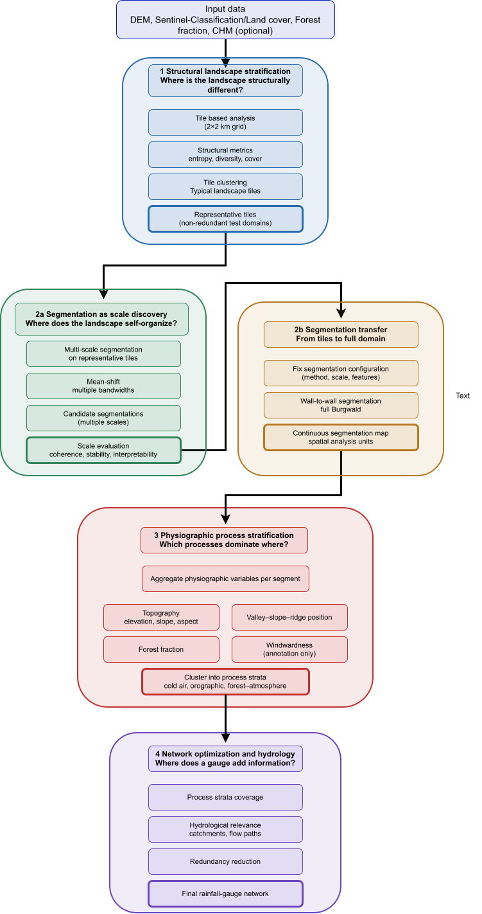

The workflow used in this worksheet emerges from a simple constraint: spatial systems such as the Burgwald are too complex, and too heterogeneous in scale, to be optimised directly for gauge placement or model validation. If structural variability, segmentation scale, and process signals are mixed into a single step, the result is usually unstable, hard to interpret, and difficult to reproduce. The framework therefore separates four stages: first, structural stratification on coarse tiles using information-theoretic and compositional metrics; second, adaptive segmentation on representative test tiles to discover meaningful spatial scales; third, transfer of the chosen segmentation configuration to the full domain and aggregation into physiographic process strata; and only then, fourth, the use of these strata as a basis for network optimisation and hydrological reasoning. Structural, physiographic, and contextual information are treated as different “layers of evidence” rather than one big predictor stack. This staged reduction of spatial complexity is designed to keep scale decisions explicit, to link segments back to physical processes, and to provide a transparent foundation for later decisions such as station placement or sampling design.

## Goals

-   Use the existing spatial data pipeline as a **fixed technical base**.
-   Understand the difference between **structural**, **physiographic**, and **process-oriented** stratification.
-   Develop a **multi-stage workflow** that:
    -   first reduces spatial complexity structurally,
    -   then discovers suitable segmentation scales,
    -   then builds process strata,
    -   and only afterwards moves toward optimisation.
-   Learn how to combine:
    -   information-theoretic and structural metrics (tile level),
    -   terrain- and land-surface descriptors (segment level),
    -   adaptive spatial segmentation (test tiles → full AOI).
-   Build a **reproducible basis** for later:
    -   station placement,
    -   sampling design,
    -   or model evaluation.

::: {.callout-tip title="Written output" appearance="simple"}
Please export all written answers as a PDF and save it in the project directory `docs/` using the filename convention  
`<Name1_NameN>_ws-XX.pdf`.

The focus of this worksheet is **conceptual understanding** and **methodological reasoning**, not producing a single “correct” result.
:::

::: {.callout-important title="Use of ChatGPT"}
You may use ChatGPT only to **improve wording and structure** of your own notes.

-   Write your own bullet points first.
-   Use ChatGPT only to **shorten, clarify, or rephrase**.
-   Do **not** ask ChatGPT for full solutions or methodological decisions.
-   If unsure, explicitly write *“I am unsure about …”* — ChatGPT may then give **guiding questions, not answers**.
-   Keep answers **short and technical**.
:::

## Prerequisites

Before starting, make sure that:

-   The project repository is cloned and opened as an **RStudio Project**.
-   The basic setup script has been executed once:
    -   project paths are defined,
    -   required input folders exist.
-   The following spatial data are available for the **Burgwald AOI**:
    -   a categorical **land-cover / Sentinel classification raster**,
    -   a **digital elevation model (DEM)**,
    -   a polygon **AOI** defining the study region.
-   Required R packages are installed and load without errors.

---

## Task 1 – Base data and spatial units (Step 0 in the diagram)

Clarify which spatial units all later steps will build on.

-   Inspect spatial resolution and extent of:
    -   the land-cover raster,
    -   the DEM.
-   Define **one coarse structural unit** for Step 1:
    -   e.g. a fixed grid of **tiles** (e.g. 2×2 km).
-   Define **one adaptive unit candidate** for Steps 2a/2b:
    -   e.g. image **segments**, **supercells**, or similar.

Short written output:

-   Which spatial unit is used **first**, and why is it suitable as a structural base?
-   Which processes are **not** well represented by fixed grid cells (e.g. cold-air drainage, flow paths)?
-   Why might **adaptive units** be preferable for later process-oriented analysis?

---

## Task 2 – Structural pre-stratification on tiles (Step 1: structural strata)

Reduce spatial complexity on the level of **coarse tiles** (structural, not yet process-based).

-   For each coarse tile, compute **structural descriptors**, e.g.:
    -   land-cover **thematic diversity**,
    -   simple **configurational / composition** metrics (e.g. forest fraction, entropy).
-   Cluster the tiles based on these structural descriptors into **structural tile clusters**.

Short written output:

-   Which variables are used, and why are they considered **structural** (not process variables)?
-   What does tile clustering achieve at this stage (in terms of complexity reduction)?
-   Why is this **not yet** a physiographic or process-based stratification?

---

## Task 3 – Selection of representative test tiles (end of Step 1)

Restrict the more expensive segmentation experiments to a **small set of test tiles**.

-   From each structural tile cluster, select **one or more representative tiles**, e.g.:
    -   closest to the **cluster centroid** in descriptor space,
    -   or with median values for key structural metrics.
-   Document the selection rule so that it is **reproducible**.

Short written output:

-   Why is it useful to restrict further analysis to **representative test tiles**?
-   What are the risks if segmentation is tuned on the **full AOI** without this step?
-   How does this step improve **reproducibility and efficiency** of later segmentation tuning?

---

## Task 4 – Adaptive segmentation on test tiles (Step 2a: segmentation as scale discovery)

Now explore how the landscape **self-organises into segments** on the representative tiles.

-   Choose one **segmentation approach**:
    -   e.g. supercells, mean-shift, region growing, or similar.
-   Apply it **only** to the selected test tiles.
-   Systematically vary **spatial and/or spectral parameters**, e.g.:
    -   bandwidths, compactness, scale parameters.

Use **raw or low-level variables** for this step:

-   e.g. DEM, land-cover, basic reflectance channels.
-   Avoid using **derived process variables** here.

Short written output:

-   Which **input variables** are used for segmentation on test tiles?
-   Why should strongly derived variables (e.g. complex indices, stability classes) be avoided at this stage?
-   What does **“over-segmentation”** vs. **“under-segmentation”** mean in this context?

---

## Task 5 – Objective evaluation of segmentation quality (Step 2a: choose scales)

Evaluate candidate segmentations on the **test tiles** using quantitative criteria.

Define at least three evaluation criteria, such as:

-   **Segment size distribution** (too many tiny segments vs. too few large segments),
-   **Intra-segment homogeneity** (e.g. variance of elevation or land-cover inside segments),
-   **Inter-segment contrast** (difference between neighbouring segments),
-   Optional: **stability under small parameter changes** (segments change only moderately).

Apply these criteria to the test tiles for several parameter settings.

Short written output:

-   Which metrics indicate **good segmentation behaviour** for the Burgwald use case?
-   Why is there **no single “optimal”** segmentation parameter set?
-   What does a **Pareto-optimal solution** mean here (trade-offs between criteria)?

---

## Task 6 – Segmentation transfer and physiographic strata (Steps 2b and 3)

Move from test-tile experiments to **wall-to-wall segments** and then to **physiographic strata**.

1. **Segmentation transfer (Step 2b)**  
   -   Fix one or a small set of **segmentation configurations** (method, scale, features) based on Task 5.
   -   Apply the chosen configuration(s) to the **full Burgwald AOI**.
   -   Result: a **continuous segmentation map** of spatial analysis units.

2. **Physiographic / process stratification (Step 3)**  
   For each segment in the full AOI, attach **process-relevant attributes**, e.g.:

   -   terrain position (valley, slope, ridge),
   -   mean elevation,
   -   forest / vegetation fractions or surface fractions.

   Cluster segments into **physiographic process strata**, e.g.:

   -   cold-air drainage strata,
   -   orographically exposed strata,
   -   forest–atmosphere coupling strata.

Short written output:

-   Which variables now directly relate to **physical processes** (not just structure)?
-   Why should **collinear or strongly derived** variables be excluded from clustering?
-   How do these **physiographic strata** differ from the initial **structural tile clusters**?

---

## Task 7 – Contextual annotation for later decision making (link to Step 4)

Prepare for later **network optimisation / hydrological design** without mixing decision criteria into the clustering space.

-   Attach **contextual descriptors** to each segment or stratum, e.g.:
    -   exposure/windwardness (annotation only),
    -   accessibility / infrastructure proximity,
    -   existing stations, land ownership (if available).
-   Keep these descriptors **separate** from the variables used for clustering into physiographic strata.

Short written output:

-   Why are these variables treated as **annotations** rather than clustering dimensions?
-   How can they still influence **final site selection** (e.g. station placement)?
-   What problems arise if such contextual variables are **included directly in clustering**?

---

# Take-home – From structure to robust design (Steps 1–4)

Write one short paragraph (max. 6–7 sentences) that explains:

-   why spatial complexity in the Burgwald must be reduced in **stages**:
    -   from **structural tiles** (Step 1),
    -   via **segmentation scale discovery and transfer** (Steps 2a/2b),
    -   to **physiographic process strata** (Step 3),
-   how **structural**, **physiographic**, and **contextual/annotative** information differ,
-   why **segmentation should precede** process-based clustering,
-   and how this workflow supports **robust station or sampling design** and later steps such as:
    -   optimisation of gauge locations,
    -   uncertainty reduction,
    -   or hydrological validation (Step 4).

  